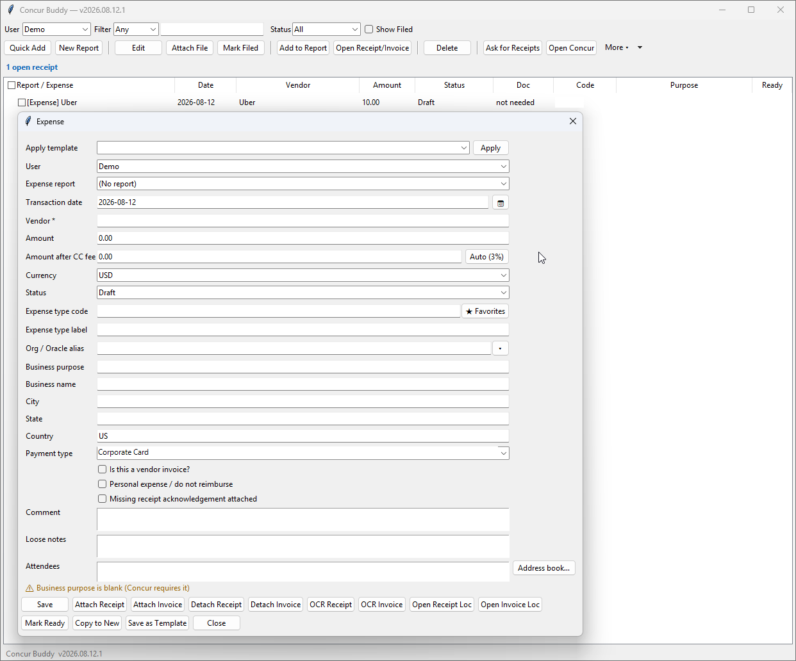

# Concur Buddy



A fast Windows desktop helper for **staging receipts and expenses before you file them in SAP Concur**.

Concur is slow, and procurement-card charges show up days after you actually spend the money — by then the
vendor name is mangled, you've forgotten which code to use, and you can't remember who was at the lunch. Concur
Buddy is the quick scratchpad you open *the moment money is spent*: log the expense with nothing but a vendor
name, drop the receipt file in later, let it remember your codes and attendees, and group everything into reports
so the eventual Concur filing is just copy-and-paste.

It also works in reverse: **import a report you exported out of Concur** and it reconciles that file against
what you have staged here — matching on amount, asking you which side wins on anything that disagrees, and never
touching your attached receipts.

And it keeps you honest about receipts you actually owe: anything at or over your **receipt limit** (default
$75, adjustable) with nothing attached is flagged **NEEDED** in the list, and one button turns those into a
plain-text list you can paste into an email to whoever owes you the receipt.

Everything is **local** — a single SQLite file on your own machine. Nothing is uploaded anywhere.

---

## Contents
- [Install & run](#install--run)
- [First-time setup](#first-time-setup)
- [The main window](#the-main-window)
- [Core workflow](#core-workflow-the-3-minute-version)
- [Feature reference](#feature-reference)
  - [Logging an expense](#logging-an-expense)
  - [Receipts vs. invoices](#receipts-vs-invoices)
  - [Status lifecycle](#status-lifecycle)
  - [Attaching files & how they're organized on disk](#attaching-files--how-theyre-organized-on-disk)
  - [OCR (reading text out of a receipt)](#ocr-reading-text-out-of-a-receipt)
  - [Expense codes](#expense-codes)
  - [Oracle / account codes](#oracle--account-codes)
  - [Vendors & templates](#vendors--templates)
  - [Templates](#templates)
  - [Expense reports](#expense-reports)
  - [Attendees (meals & events)](#attendees-meals--events)
  - [Users & delegates](#users--delegates)
  - [Searching & filtering](#searching--filtering)
  - [Filing into Concur](#filing-into-concur)
  - [Importing a Concur export (reconciling)](#importing-a-concur-export-reconciling)
  - [Attendees (the address book Concur doesn't give you)](#attendees-the-address-book-concur-doesnt-give-you)
  - [Coding an expense to an org (no report needed)](#coding-an-expense-to-an-org-no-report-needed)
  - [Money you paid yourself (the 30-day clock)](#money-you-paid-yourself-the-30-day-clock)
  - [Report folders on disk](#report-folders-on-disk)
  - [Knowing which card paid](#knowing-which-card-paid)
  - [Asking someone for receipts](#asking-someone-for-receipts)
  - [Do I even need a receipt?](#do-i-even-need-a-receipt)
  - [Settings](#settings)
  - [Import / export](#import--export-all-under-more-)
- [Where your data lives](#where-your-data-lives)
- [Updating](#updating)
- [Troubleshooting](#troubleshooting)

---

## Install & run

1. **Install Python 3.11 or newer** (Windows: get it from [python.org](https://www.python.org/downloads/) and
   tick *"Add Python to PATH"* during install). The app uses only Python's built-in libraries, so there is
   nothing else to install for the core features.
2. **(Optional) OCR support** — only needed if you want the app to read text out of image/PDF receipts:
   - Install [Tesseract for Windows](https://github.com/UB-Mannheim/tesseract/wiki).
   - `pip install pytesseract pillow pypdf`
3. **Launch it** — double-click **`run_concur_buddy.bat`**, or from a terminal run:
   ```
   python concur_buddy.py
   ```

That's it. The first launch creates your local database automatically; no account, no sign-in.

---

## First-time setup

**On your very first launch**, the app asks where to keep its database. Choose **Yes** to use the default
location (`%APPDATA%\ConcurBuddy`), or **No** to pick a folder yourself — e.g. a **Google Drive folder** so it
backs up and can be shared across your devices. You can change this any time later in **Settings → Database**.

When you open the app, click **Settings** once and set:

- **Inbox path** — the folder where receipts land before you file them (defaults to your `Downloads`). When you
  attach a file *from this folder*, the app **moves** it out, so your inbox stays clean.
- **Receipt root** — the folder where the app files your organized receipts (defaults to
  `Documents\Expense Receipts`).

You can also **Add User** here (see [Users & delegates](#users--delegates)). One starter user — *Me* —
exists by default as an example; rename or replace it with your own.

---

## The main window

```
┌──────────────────────────────────────────────────────────────────────────┐
│ User [▼]  Filter [Any ▼]  [search…]  Status [All ▼]  ☐ Show Filed         │  ← filter row
├──────────────────────────────────────────────────────────────────────────┤
│ Quick Add  New Report │ Edit  Attach File  Mark Filed │ Add to Report     │  ← toolbar (the everyday actions,
│ Open Receipt/Invoice │ Delete │ Ask for Receipts  Open Concur  [More ▾]   │     grouped; wraps when narrow)
├──────────────────────────────────────────────────────────────────────────┤
│ 5 open receipts · 2 need a receipt · 1 ready to file                      │  ← counter (click it to tick
│                                                                          │     everything that owes one)
├──────────────────────────────────────────────────────────────────────────┤
│ [ ] Report / Expense   date  vendor  amount  status  doc  code  …         │  ← heading box = select all
│ [ ] ▸ [Report] Q2 Travel                                                  │  ← reports group their expenses
│      [x] [Expense] Marriott    …                                          │  ← ticked = selected
│ [ ] [Expense] Starbucks     …                                             │  ← loose (unassigned) expenses
└──────────────────────────────────────────────────────────────────────────┘
```

The toolbar carries only the **everyday actions**, grouped by dividers. Everything else lives one click away
under **More ▾**: the four glossaries (Expense Codes / Oracle Codes / Vendors / Templates), Copy Expense,
Move to User…, Add User…, the clipboard helpers (Copy Concur Summary / Copy Attendees), folder shortcuts
(Open File Location / Open Receipt Root / Open Inbox), Export/Import, Refresh, Settings, and About. Row-scoped
actions are also on the **right-click menu** directly on a row: *Add to report*, *Copy expense*, *Edit*,
*Open receipt/invoice*, *Open file location*, *Open report folder*, *Copy Concur summary*, *Ask for these
receipts*, *Move to user*, *Mark filed* and *Delete*.

**Keyboard shortcuts:** `Ctrl+N` new expense · `Ctrl+Shift+N` new report · `F2` edit selected · `Ctrl+D` copy
expense · `Delete` delete selection · `Space` tick/untick the current row · `F5` refresh.
(`Delete`/`Ctrl+D` only act when the table itself has focus — pressing Delete inside the search box never
deletes an expense.) `Esc` closes any dialog.

Just above the table, a **counter** keeps score of what is still on your plate: how many expenses are not
marked *Filed* yet, how many of those have no receipt or invoice attached, and how many are already *Ready to
file*. It deliberately ignores the search box, so it always shows the full pile — and it reads *"No open
receipts — all caught up."* when you are clear.

Every row carries a **check box on the left**, like Concur's own expense list. Ticking a box does exactly what
Ctrl-clicking the row does: it adds (or removes) that one row from the selection and leaves the rest alone. So
you can build up a batch with plain clicks and then hit **Add to Report**, **Mark Filed** or **Delete**.
Ctrl/Shift-click still works and ticks the boxes to match, the box in the **column heading** selects or clears
every expense at once, and `Space` toggles the row you are on.

The center is a tree: **expense reports** appear as parent rows with their assigned expenses nested underneath,
and **loose expenses** (not yet in a report) sit at the top level. The `doc` column shows what's attached — `Receipt`, `Invoice`, `Receipt+Invoice` — or, when nothing is,
whether one is actually owed: **NEEDED** (and the row turns amber) or *not needed*. A `✓` in the `ready` column means the expense is *Ready to file*
or already *Filed*.

> The toolbar automatically **wraps** to more lines when the window is narrow, so nothing is ever cut off — resize
> freely.

---

## Core workflow (the 3-minute version)

1. **You spend money.** Open the app, click **Quick Add**, type the **vendor name**, click **Save**. Done — the
   date is logged for you and the expense sits in *Draft*. Everything else can wait.
2. **The receipt arrives** (or you download a PDF invoice). Select the expense → **Attach File** → pick **Attach
   Receipt** or **Attach Invoice**. The file is renamed and filed on disk automatically, and the status moves
   forward on its own.
3. **Fill in the rest when convenient** — amount, expense code, business purpose, attendees. The app remembers
   the code you used last time for that vendor. Attached the wrong file? **Detach Receipt / Detach Invoice**
   (in the expense dialog) un-links it — nothing is ever deleted — and offers to move the file back to your
   inbox so you can attach it to the right expense.
4. **Group related expenses** under a report with **New Report** + **Add to Report** — or Ctrl/Shift-click several
   expenses and **drag them onto the report row** (the target row highlights, and a badge shows how many you're
   holding). Optional but handy for trips/events.
5. **Chase what you're owed.** Rows the list marks **NEEDED** are the ones that actually need a receipt.
   Click the counter (or **More ▾ → Select the receipts I am owed**) to tick them all, then **Ask for Receipts**
   for a plain-text list to paste into an email.
6. **When it's time to file**, mark it *Ready to file* and open Concur with **Open Concur**. Two ways to get
   the details in: the **Concur Buddy Autofill browser extension** (More ▾ → *Export for Autofill…*, then one
   click per expense fills the Concur form — fields, dropdowns, and the receipt; you review and Save), or paste
   manually with **Copy Concur Summary** / **Copy Attendees**. Then **Mark Filed** to archive it.
   *(Autofill setup: the `autofill_extension/` folder — load it once via Chrome's Load unpacked; see its README.)*
7. **Filed it in Concur already?** **More ▾ → Import Concur Export (.xlsx)…** pulls the report back in and
   reconciles it with what you staged, so the two never drift apart.

---

## Feature reference

### Logging an expense
**Quick Add** opens the expense dialog. The *only* required field is **Vendor** — everything else is optional and
can be filled in later. Useful fields:

- **Transaction date** — auto-filled with today; type it, or click the **📅** button to pick from a calendar.
- **Amount**, **Currency** (USD). You can type `$` and commas (e.g. `$1,405.00`) — they're stored as a clean
  number so report totals add up. (Existing entries that were saved as text are cleaned automatically on launch.)
- **Amount after CC fee** — the charge once a credit-card surcharge is added. Click **Auto (3%)** to fill it from
  **Amount** using the industry-standard 3% fee, or type your own value.
- **Expense type code / label** — start typing a number or name and pick from the autocomplete (see
  [Expense codes](#expense-codes)).
- **Business purpose, business name, city/state/country** — Concur fields, staged here so you don't re-derive
  them at filing time.
- **Payment type** — e.g. corporate card vs. personal/reimbursable.
- Checkboxes: *Is this a vendor invoice?*, *Personal expense / do not reimburse*, *Missing receipt
  acknowledgement attached*.
- Free-text **Comment**, **Loose notes**, **Attendees**, and an **OCR / extracted text** box.

Click **Save** to store it (re-validates that a vendor is present). **Close** discards unsaved changes.

### Receipts vs. invoices
A single expense record holds **both** a receipt and an invoice — there is no either/or "document type" dropdown.
This matches reality: you often get a vendor **invoice** first and the **paid receipt** later. The dialog has
separate **Attach Receipt** and **Attach Invoice** buttons (and separate **OCR Receipt** / **OCR Invoice**
buttons), plus an optional **Invoice number** field. Use **Open Receipt Loc** / **Open Invoice Loc** to jump to
either file in Explorer.

### Status lifecycle
Every expense moves through these stages:

`Draft → Awaiting invoice → Awaiting receipt → Receipt received → Ready to file → Filed`

You rarely set this by hand — **attaching a document advances it for you** and never drags it *backward* past a
later stage:
- Attach a **receipt** → moves to *Receipt received*.
- Attach an **invoice** with no receipt yet → moves to *Awaiting receipt* (you're waiting on the paid receipt).
- Click **Mark Ready** in the dialog (or set Status manually) when it's ready for Concur.
- **Mark Filed** on the main window stamps it *Filed* with a timestamp and tucks it into the archive.

### Attaching files & how they're organized on disk
When you attach a file, Concur Buddy copies it into:

```
<Receipt Root>\<User>\<Year>\YYYY-MM-DD Vendor Amount Receipt.ext
                                YYYY-MM-DD Vendor Amount Invoice.ext
```

So a $12.50 Starbucks receipt for user Me dated 2026-06-18 becomes
`…\Me\2026\2026-06-18 Starbucks 12.50 Receipt.pdf`. Folders stop at the **year** (no month subfolders).
Naming collisions get a `(2)`, `(3)` suffix automatically.

- If the file came **from your inbox folder**, it is **moved** (the original leaves the inbox).
- If it came from anywhere else, it is **copied** (your original is left untouched).

The **Attach File** button on the main window opens the selected expense's dialog; with nothing selected it just
opens your receipt-root folder.

### OCR (reading text out of a receipt)
With OCR installed (see [Install](#install--run)), **OCR Receipt** / **OCR Invoice** pull the text out of the
attached file into the *OCR / extracted text* box — handy for grabbing an amount or invoice number. Machine-readable
PDFs are read directly (via `pypdf`); image-based files fall back to Tesseract. Without OCR installed, the box
shows a short note telling you what to install — the rest of the app works fine.

### Expense codes
The **Expense Codes** glossary is a searchable list of expense-type codes. **No code list ships with the
app** — expense-type charts are org-specific, so this works best seeded with your organization's
pre-established list. Most orgs publish one somewhere internal: check your intranet's finance/accounting
pages for the current expense-type or GL-code list, or read the entries straight out of Concur's own
expense-type picker. Format what you find as an `expense_codes.csv` next to the app — header
`code,name,tags`, one row per expense type (tags = the category, used by autocomplete search) — and it is
imported automatically on startup. You can also add codes one at a time in the glossary window. In any
expense, the **Expense type code** field autocompletes as you type a number, name, **or tag**. In the
glossary window you can **search**, **Toggle Favorite** (favorites sort to the top of autocomplete),
**Edit Notes**, **Edit Tags/Aliases**, and **Delete**.

Codes are deliberately allowed **multiple identities**, because accounting practice is messier than the
official list: the same GL code can be listed as more than one official expense type (both rows exist, and
the picker keeps them distinct), and a code
is often used colloquially for things its official name doesn't suggest. Put the **colloquial names your
accounting team actually says** in **Tags/Aliases** (they're matched by the autocomplete search), and use
**Notes** to record *why* ("accounting says use this one for X"). Favorites, tags, and notes are all yours —
updates to the shipped list never overwrite them.

### Oracle / account codes
The **Oracle Codes** glossary holds account/oracle codes used on reports. It comes pre-seeded, autocompletes as
you type, and **grows automatically** when you enter a new code on a report. You can **Add Oracle Code** by hand,
favorite, annotate, or delete entries.

### Vendors & templates
The **Vendors** glossary remembers every vendor you've used and the **last expense code** you applied to it. The
next time you type that vendor into an expense, the app **auto-fills that code** for you (if you haven't already
typed one). Favorite, annotate, or delete vendors here.

### Templates
A **template** is a named, reusable set of expense fields you apply with one click — handy for expenses you log
over and over (the same Uber ride, a recurring vendor, a standard meal). The app ships with a starter set of
**common-vendor templates** — Uber, Amazon, ClickUp, Calendly, Doodle, Staples, catering, florist, and event
entertainment — each pre-filled with that vendor's usual expense code and business purpose. Delete any you don't
want (they stay gone), or add your own. Every template requires a **vendor**.

- **Apply a template:** in the expense dialog, pick one from the **Apply template** dropdown at the top (or click
  **Apply**). The template's saved fields — vendor, expense code, payment type, whatever was stored — fill in
  instantly. You can still edit anything afterward.
- **Save the current expense as a template:** in the expense dialog, click **Save as Template**. You name it and
  **tick exactly which of the filled fields to keep** (just the expense code, or everything — your call). Vendor is
  always included.
- **Manage templates:** **More ▾ → Glossaries → Templates…** opens the manager — **New** (build one from
  scratch), **Edit** (double-click a row), and **Delete**. Templates are also carried by **Export/Import Setup**.

> Templates only store reusable fields. Per-expense details — the transaction date, attached receipt/invoice files,
> invoice number, and OCR text — are intentionally **not** saved into a template.

### Expense reports
**New Report** creates a report — again, only a **name** is required. Reports carry the Concur header fields (dates,
travel purpose/type, expense group, grant vs. non-grant, oracle alias, etc.). A new report starts **empty**. Use
**Add to Report** on a selected expense to drop it into a report (or `<Unassigned>` to pull it back out); assigned
expenses then nest under the report row in the tree, and the report row shows the **summed total**. You can also set
the report right inside the expense dialog via its **Expense report** dropdown (`(No report)` = leave it loose).

**Copy Expense** (`Ctrl+D`, More ▾, or right-click) duplicates the selected expense as a new **Draft** — vendor,
amount, expense code, and report grouping are carried over; the attached files and Filed status are cleared — then
opens the copy for editing. Handy for logging a run of similar expenses without retyping. Inside the expense dialog,
**Copy to New** does the same from the open expense: it saves what's on screen, then opens a fresh Draft copy.

**Filing several expenses into a report at once:** hold **Ctrl** (or **Shift**) and click to select multiple
expenses, then either **right-click → "Add to report…"** or **drag the selected rows onto a report row** — the
report row under your cursor highlights, and a small badge shows how many expenses you're dragging. The same
multi-selection also works for **Delete** and **Mark Filed** — they act on every selected expense. Right-clicking a
single row selects it and opens the same menu (Add to report, Copy, Edit, open/reveal the attachment, Copy Concur
summary, Move to user, Mark filed, Delete).

**Opening a report:** double-click a report row to open its **header fields** — the ones Concur asks for on
*Create Expense Report*. To **expand/collapse** a report and see the expenses inside it, use the `+`/`−` control
on the left (the rows are deliberately tall to make it an easy target);
to open the report's own editor, select it and click **Edit** (or press `F2`). Rows are sized tall so the little
**+/−** expand control is easy to hit.

> Closing the expense or report dialog with unsaved edits (the Close button, the window **X**, or `Esc`) asks
> whether to **save, discard, or keep editing** — nothing is ever silently lost.

### Attendees (meals & events)
Type the attendee list into an expense's **Attendees** box when you log a meal or event, while you still remember
who was there. At filing time, select the expense and click **Copy Attendees** to put the list on your clipboard,
ready to paste into Concur.

### Users & delegates
A **User** dropdown at the top scopes the entire window — expenses, reports, and receipt folders are kept per-user
and filed completely separately. This supports the delegate pattern (e.g. you file your own expenses *and* file as
a delegate for a colleague). Add users with **More ▾ → Add User…** (or **Settings → Add User**):
you're asked for the user's name and then for **their receipt save folder** — you can create a new folder right
there, or Cancel to use the shared receipt root. That user's receipts then file under their own folder (by year). If
you logged something under the wrong person, select it and use **More ▾ → Move to User…** (also on the right-click
menu) to reassign it (moving an expense detaches it from any report to avoid cross-user grouping).

### Searching & filtering
On the filter row:
- **Filter** picks which column to search (`Any`, vendor, amount, status, doc, code, purpose, date); the text box
  filters live as you type.
- **Status** narrows to one stage.
- **Show Filed** — *Filed* expenses are **hidden by default** so your working list stays short; tick this to see
  the archive.

### Filing into Concur
- **Open Concur** (toolbar) launches the SAP Concur site in your browser.
- The expense dialog shows a live **Concur check line** at the bottom: it warns when Concur will want something
  you haven't staged (a receipt for expenses over $75, an invoice number on a vendor invoice, a Business purpose)
  and turns into a green ✓ when everything passes. It never blocks saving — Concur enforces, this just reminds.
- **Copy Concur Summary** (More ▾ or right-click) copies a one-line summary of the selected expense (date, vendor,
  amount, code, purpose, comment) for quick pasting. A confirmation flashes in the footer.
- **Copy Attendees** (More ▾) copies the attendee list.
- **Open Receipt/Invoice** (toolbar or right-click) opens the attached file; **Open File Location** (More ▾ or
  right-click) reveals it in Explorer.
- **Open Receipt Root** / **Open Inbox** (More ▾) jump to those folders.
- After filing in Concur, select the expense and click **Mark Filed**.

### Importing a Concur export (reconciling)
**More ▾ → Import Concur Export (.xlsx)…** goes the *other* way: it reads a report you exported out of Concur
and reconciles it against what is already staged here. Export the report's entries view from Concur as Excel,
then point this at the file — no extra software needed, the app reads `.xlsx` on its own.

**How rows are matched.** The **amount** is the anchor: only expenses matching to the cent are candidates at
all, which at this volume is nearly unique. The transaction date and how alike the two vendor names look only
*rank* those candidates — they never invent one. That matters because the card feed's merchant string rarely
looks like what you typed (`EXAMPLE PARKING 123` vs `Sample Parking`). A same-amount row is only *proposed* as a
merge when something backs it up — a date within about a month, or names that genuinely resemble each other;
otherwise it defaults to *Add as new* with the near-miss still listed one click away.

**Nothing is written until you press Apply.** Every row shows what will happen first — merge into a named staged
expense, add as new, or skip — and you can change any of them. Double-click a row to pick a different match or
settle a field.

**What each row will do.** Every imported row does exactly one of three things, named the same way on the
buttons and in the *What will happen* column: **Update** an expense you already have staged here (its receipt,
notes and status stay yours), **Add** it as a new expense, or **Ignore** it. Rows are colour-coded — amber
still wants a decision from you, green will update cleanly, blue becomes a new expense, grey is ignored — and
a ✓ appears once you have been through a row.

**Which side wins.** Double-click a row (or **Review…**) to open a comparison table — one line per field, with
your value, the export's, and which one to use:

| Kind of field | What happens | Do you choose? |
|---|---|---|
| **Locked** — transaction date, vendor name, amount, payment type, currency | The export wins | No. Concur greys these out because they come from the card feed; neither side can edit them |
| **Blank here** | The export fills it in | No — there is nothing to lose |
| **Filled on both sides** and different | You pick | **Yes** — per field, or set all of them at once with *Take the export* / *Keep mine* |

Fields you pick default to **keeping your Concur Buddy value**. The expense type's *code and name* count as one
field, so a merge can never mint a code/name pair that exists in neither system.

**Attachments are never touched.** An export has no files in it, so a merge leaves your staged receipt and
invoice exactly where they are — as does the status. If Concur's own *Receipt* column says it does **not** have
an image for an expense you have a file for here, that's called out in the summary, so you know what still
needs uploading.

Also on import: unmatched rows become new expenses (status *Receipt received* if Concur already holds the
receipt, otherwise *Awaiting receipt*), everything can be grouped under a report named after the file, any
expense type the export mentions is learned into your Expense Codes glossary, and any column this app has no
field for is kept as a note on new expenses rather than dropped.

> Because the export's vendor name wins, a merged expense takes on the card's merchant string. Files already
> organized on disk keep the name they were filed under.

### Attendees (the address book Concur doesn't give you)
Concur makes you find attendees one at a time, and its import spreadsheet is fussy. **More ▾ → Glossaries →
Attendees…** (or the **Address book…** button beside the Attendees box on an expense) keeps your own list and
hands Concur a file it will accept.

**Getting people in is deliberately forgiving.** *Paste people…* takes one per line, in any of these shapes:

```
Chidi Okafor <c.okafor@mail.example.edu>  Whitfield, Dana; dwhitfield@example.edu; Example Co
c.okafor@mail.example.edu                 Reyes    Marisol    mreyes@example.edu
```

It shows what it understood before saving anything. Two rules matter: a comma only separates *fields* when
there's no tab or semicolon and at least two of them, so `Okafor, Chidi` is never torn in half; and a line
whose first field is a single word is read as spreadsheet columns in Concur's own order (Last, First, …),
while anything else treats the first field as a whole name — so `Chidi Okafor; Example Co` keeps the company.
Pasting someone twice never duplicates them, and a later, richer paste fills in blanks without overwriting
anything you already had.

**Emails are stored as you paste them.** Nothing is rewritten by default. If your organisation has two
domains and you want one swapped for the other, add rewrites in Settings, one `from=to` per line — e.g.
`mail.example.edu=example.edu`.

**Two ways out**, both from the ticked people:

- **Export for Concur…** writes the attendee-import spreadsheet, laid out exactly like `AttendeeImportTemplate.xls`
  in this folder: two header rows (Concur's internal field names, then the labels) above the people, columns in
  the template's order — `Attendee Type | Last Name | First Name | Attendee Title | Company` — and the attendee
  **type code** (`SYSEMP`, `BUSGUEST`, `SPOUSE`, `STUDENT`, `PARTNER`) rather than its label. Upload it under
  *Add Attendees → Import Attendees*. Note the template has **no email column** — Concur matches on the names —
  so email is kept here, not sent there.
- **Copy emails** puts the tidied addresses on the clipboard, for finding employees in Concur's own search,
  which is where email actually identifies someone.

### Coding an expense to an org (no report needed)
Most spend gets coded and filed without ever becoming a report, so the **Org / Oracle alias** picker sits on
the expense itself, not just the report header. Click it (or the ▾) to see the aliases you already use,
search by name rather than remembering the number, and type a new one to add it. Whatever you set here is
saved on that expense alone.

Report headers have the same picker, plus the rest of the fields Concur demands when you create a report —
**double-click a report row** to open them. (Expanding a report to see the expenses inside is still the `+`/`−`
control on the left.)

### Money you paid yourself (the 30-day clock)
Anything with a payment type of **Personal / reimbursable** is money you are owed, and it has to be claimed
back within 30 days. The reimbursement run is month-end, so in the **last 7 calendar days of a month** every
unfiled personal expense turns **red** in the list and the home counter adds *"N to claim back before the
month ends"*. Outside that window it stays quiet — a flag that is always on is not a flag. Ticking *Personal
expense / do not reimburse* opts an expense out entirely.

### Report folders on disk
Adding expenses to a report also gathers their receipts into a folder of their own:

```
<receipt root>\<user>\Reports\<report name>\
```

It runs whenever expenses land in a report, and **More ▾ → Open Report Folder…** refreshes and opens it for the
selected report. The files in there are **copies** — the originals stay filed under `<user>\<year>` exactly
where the database expects them, so this can never be the reason an attachment goes missing. Re-running it
only copies what is not already there, and it tells you if an expense's file has gone astray.

### Knowing which card paid
Set your cards up once in **More ▾ → Glossaries → My Cards…** (or Settings → *My cards…*): the **last four
digits**, the **network**, and which payment type that card means — say a personal Visa versus the corporate
Mastercard.

Then when you **OCR** a receipt, the text is searched for that card, and a match offers to set the payment
type for you — including telling you when it looks like money you will need claiming back.

A card is only recognised when **both** the network and the last four appear. That is deliberate: the digits
alone match invoice numbers and phone numbers, and the network alone matches every "we accept Visa" footer.
The phrasings it copes with include *Visa ending in 1234*, *VISA ****1234*, *Mastercard&nbsp;&nbsp;*1234*,
*4111 1111 1111 1234*, *Paid with Visa (1234)*, and a grocery slip that prints `CHIP CARD: MASTERCARD` several
lines from the masked number. When the two sit close together it says so plainly; when they are far apart it
still matches but tells you to double-check. If two of your own cards both appear, it changes nothing and says
so rather than guessing.

### Asking someone for receipts
Chasing a receipt usually means emailing whoever has it. **Ask for Receipts** (toolbar, or the right-click menu)
turns the ticked expenses into plain text built for that email:

```
• Sample Conference Center — $512.00 — Jul 17, 2026
• Example Parking Garage — $150.00 — Jul 24, 2026

2 receipts, $662.00 total
```

Vendor, amount, date — the three things the other person needs to *find* the receipt, and nothing about Concur
that would only confuse them. No tabs and no aligned columns, because both collapse when pasted into Gmail or
Outlook. Edit the text in the box first if you want, then **Copy to clipboard** and paste it into your email.

With nothing ticked it offers the expenses already marked **NEEDED**. To tick those yourself, click the
home-screen counter or use **More ▾ → Select the receipts I am owed**.

### Do I even need a receipt?
The `Doc` column answers that directly. With a file attached it names it (`Receipt`, `Invoice`,
`Receipt+Invoice`). With nothing attached it says **NEEDED** — and tints the row amber — only when the expense
is at or above your **receipt limit**; anything below reads *not needed* and is left alone. The home-screen
counter counts the same way, so "3 need a receipt" means three you actually have to chase.

Set the limit in **More ▾ → Settings → Receipt needed at or above** (default **$75**). It lives in the
database, so it follows you across machines, and the expense dialog's own warning uses the same number.
An expense with *Missing receipt acknowledgement attached* ticked never counts as owing one.

### Settings
Set your **Inbox path** and **Receipt root** (with **Browse** buttons) and **Add User**. Also here:

- **Receipt needed at or above** — the amount that decides whether the list nags you for a receipt. Default
  **$75**; it lives in the database, so it follows you across machines.
- **My cards…** — the cards you pay with, so OCR can tell whose money it was. See
  [Knowing which card paid](#knowing-which-card-paid).
- **Email rewrites** — optional `from=to` domain swaps for pasted attendee addresses. Empty by default.

Inbox path and Receipt root are stored per-machine; everything else is in the database. The **Database** section shows where the database currently lives and lets you:
- **Move database…** — pick a new folder (e.g. a Google Drive folder); the app copies your data there, switches to
  it, and offers to delete the old copy.
- **Use existing database…** — point at an already-existing database file (e.g. the one your other device synced
  via Drive), and the app switches to it.

> **Multi-device tip:** keeping the database in a synced folder (Google Drive, OneDrive) lets you use Concur Buddy
> across devices — but **don't open the app on two devices at the same time**, or the sync may create conflict
> copies. Put your **Receipt root** on the synced drive too so the actual files follow you. Attachment paths are
> stored per-machine (the drive letter / username before the Receipt root differs on each computer), but the app
> **re-anchors them to the current machine's Receipt root automatically** — so **Open Receipt/Invoice** works on any
> device as long as its Receipt root points at the same synced folder tree. (Note: **Export Config** does *not*
> include users — users live in the database, so a synced database carries them, an exported config does not.)

### Import / export (all under More ▾)
- **Ask for Receipts** — see [Asking someone for receipts](#asking-someone-for-receipts).
- **Import Concur Export (.xlsx)…** — reads a report exported out of Concur and reconciles it with what is
  staged here: see [Importing a Concur export](#importing-a-concur-export-reconciling).
- **Export Expenses to CSV…** — dumps all expense rows to a CSV for backup or analysis.
- **Export for Autofill…** — writes the selected expenses (or, with nothing selected, everything
  *Ready to file*) as `staged_expenses.json` for the **Concur Buddy Autofill** browser extension,
  which fills Concur's New Expense form for you one click per expense (you still review and Save
  in Concur). Extension + setup: the `autofill_extension/` folder in the repo.
- **Export Setup…** — writes a JSON of your *settings, users, oracle codes, vendors, expense codes, and templates* —
  **but not your expense rows**. Use it to move your setup to another machine or hand a clean-slate configuration
  to someone else.
- **Import Setup…** — merges such a JSON back in.

---

## Where your data lives

Your database is stored **outside this app folder**, by default at:

```
%APPDATA%\ConcurBuddy\concur_buddy.sqlite3
```

That means updating the app (replacing this folder) **never touches your data**. It also means a fresh download
of the app starts completely empty — no personal data travels with the code.

You can relocate the database (e.g. to a synced Google Drive folder) on first launch or later via **Settings →
Database** (see above). When you do, a small pointer file at `%APPDATA%\ConcurBuddy\db_location.txt` records where
it went, so the app finds it on the next launch.

Organized receipt files live under your chosen **Receipt root** (default `Documents\Expense Receipts`).

---

## Updating

Download the latest copy of this folder and replace your old one. Because your database and receipts live
elsewhere (above), updating is safe — the new version upgrades your database in place automatically. Optionally
back up `%APPDATA%\ConcurBuddy\concur_buddy.sqlite3` first.

---

## Troubleshooting

| Symptom | Fix |
|---|---|
| `python` is not recognized | Python isn't on your PATH. Reinstall Python 3.11+ with *"Add Python to PATH"* ticked, or run with the full path to `python.exe`. |
| OCR box says "OCR unavailable" | Install [Tesseract](https://github.com/UB-Mannheim/tesseract/wiki) and `pip install pytesseract pillow pypdf`. The rest of the app still works without it. |
| Attached file "no longer exists" when opening | The original was moved or deleted after attaching. Re-attach it. |
| I want a clean slate | Close the app and delete `%APPDATA%\ConcurBuddy\concur_buddy.sqlite3` — it will be recreated empty on next launch. |
